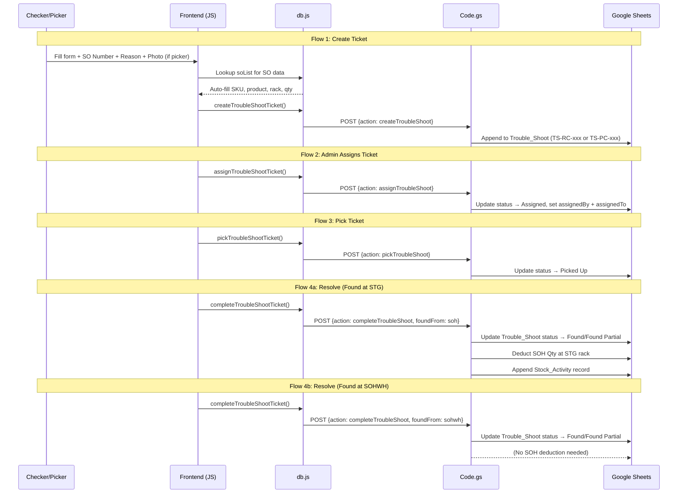

# Troubleshoot Feature — Implementation Strategy

## Feature Summary

A **ticket-based troubleshooting system** for warehouse checkers and pickers. Checkers or Pickers create request tickets when items cannot be found during the checking/picking process. An Admin/Supervisor assigns the ticket to a Troubleshooter. The Troubleshooter picks up the ticket, physically locates the item using rack scanning (searching `origin_rack_name` → `SOH STG racks` → `SOHWH`), and updates the system with results. When items are found at a `SOH.Rack Location` (STG racks), the system automatically deducts SOH stock and logs activity.

---

## Architecture Overview

The IRMS project uses a **3-layer architecture**:

| Layer | Technology | Key Files |
|-------|-----------|-----------|
| **Frontend** | Vanilla JS + Vite | `src/components/*.js`, `src/main.js` |
| **Data Layer** | IndexedDB cache + Google Sheets CSV sync | `src/data/db.js`, `src/data/cacheManager.js` |
| **Backend** | Google Apps Script (GAS) | `gas/Code.gs` |

Data flows: **Google Sheets → CSV/JSON fetch → `db.js` parse → IndexedDB cache → UI component**. Writes go: **UI → `db.js` method → `fetch(webAppUrl, POST)` → GAS `doPost()` → Google Sheets**.

---

## Proposed Changes

### 1. Google Sheets — New Tab

#### [NEW] `Trouble_Shoot` sheet tab

Create a new sheet tab in the existing spreadsheet with these headers:

| Column | Field Key | Description |
|--------|-----------|-------------|
| id | `id` | Unique ticket ID — `TS-RC-XXXXXX` for checker, `TS-PC-XXXXXX` for picker |
| Request Timestamp | `requestTimestamp` | ISO timestamp of creation |
| Requested By | `requestedBy` | Requester name (checker or picker) |
| Staff ID | `staffId` | Requester's staff ID |
| Checker Line | `checkerLine` | Checker line identifier (**hidden when user role is picker**) |
| Photo | `photo` | Image input (required for picker, optional for checker) |
| Reason | `reason` | Reason for request: `Bad Item` / `Wrong Picking` / `Missing Item` |
| Picker Name | `pickerName` | Original picker name (from SO_DATA) |
| SO Number | `soNumber` | SO Number (from SO_DATA) |
| SKU Number | `skuNumber` | SKU code (from SO_DATA) |
| Product Name | `productName` | Product name (from SO_DATA) |
| Origin Rack Name | `originRackName` | Origin rack (from SO_DATA) |
| Request Quantity | `requestQuantity` | Requested qty (from SO_DATA) |
| Assigned By | `assignedBy` | Admin / Spv name who performed the assignment |
| Assigned To | `assignedTo` | Troubleshooter (picker) name who accepted the ticket |
| Status Ticket | `statusTicket` | `Open` / `Assigned` / `Picked Up` / `Found` / `Found Partial` / `Not Found` |
| Troubleshoot Evidence | `troubleshootEvidence` | Image input (uploaded by troubleshooter) |
| Found Qty | `foundQty` | Quantity found by troubleshooter |
| Found At | `foundAt` | Rack name where item was found |
| Delivered At | `deliveredAt` | Freetext/scanner input for delivery confirmation |
| Picked By | `pickedBy` | Staff ID of troubleshooter who picked the ticket |
| Update At | `updateAt` | Last updated timestamp |

---

### 2. Config Layer

#### [MODIFY] [googleSheets.js](file:///c:/AI Project/IRMS/src/config/googleSheets.js)

Add the new tab reference to the `tabs` config object:

```diff
  tabs: {
    ...existing tabs...
+   troubleShoot: 'Trouble_Shoot',
  }
```

---

### 3. Backend (Google Apps Script)

#### [MODIFY] [Code.gs](file:///c:/AI Project/IRMS/gas/Code.gs)

Add **4 new GAS handler actions** to `doPost()`, following the established pattern from `handleCreateStockMovement` / `handleUpdateStockMovement` / `handleCompleteStockMovement`:

| Action | Handler Function | Purpose |
|--------|-----------------|---------| 
| `createTroubleShoot` | `handleCreateTroubleShoot(ss, data)` | Checker/Picker creates a new ticket (status: `Open`). Generates ID as `TS-RC-XXXXXX` (checker) or `TS-PC-XXXXXX` (picker). |
| `assignTroubleShoot` | `handleAssignTroubleShoot(ss, data)` | Admin/Spv assigns ticket to a troubleshooter → status: `Assigned`, sets `assignedBy`, `assignedTo`, `updateAt` |
| `pickTroubleShoot` | `handlePickTroubleShoot(ss, data)` | Troubleshooter picks up an assigned ticket → status: `Picked Up`, sets `pickedBy`, `updateAt` |
| `completeTroubleShoot` | `handleCompleteTroubleShoot(ss, data)` | Troubleshooter resolves ticket → status: `Found` / `Found Partial` / `Not Found`, sets `foundQty`, `foundAt`, `troubleshootEvidence`, `deliveredAt`, `updateAt`. **If found from SOH STG rack:** auto-deducts SOH stock + appends Stock_Activity record. **If found from SOHWH:** no SOH deduction needed. |

##### Ticket ID Generation Logic (inside `handleCreateTroubleShoot`):

```
IF requester role === 'checker':
  id = 'TS-RC-' + 6-digit padded sequential/random number
ELSE IF requester role === 'picker':
  id = 'TS-PC-' + 6-digit padded sequential/random number
```

##### SOH Deduction Logic (inside `handleCompleteTroubleShoot`):

```
IF (status === 'Found' OR status === 'Found Partial') AND foundAt contains "STG" (SOH.Rack Location):
  1. Find matching row in SOH sheet: SKU Number + Rack Location === foundAt
  2. Deduct foundQty from Qty SOH
  3. Append Stock_Activity record with operator [-]

IF foundAt is from SOHWH.rack_name:
  → No SOH deduction required
```

> [!IMPORTANT]
> This reuses the exact same SOH deduction + Stock_Activity logging pattern already implemented in [handleCompleteStockMovement](file:///c:/AI Project/IRMS/gas/Code.gs#L929-L1140). We will extract the shared logic into a helper or duplicate the proven pattern.

---

### 4. Data Layer (Frontend)

#### [MODIFY] [db.js](file:///c:/AI Project/IRMS/src/data/db.js)

**Add the following, following established patterns from stockMovement/lostAndFound:**

1. **New data property**: `this.troubleShootTickets = []` (constructor, line ~18)
2. **IndexedDB hydration**: Add `cacheManager.getStore('troubleShoot')` to `initCache()`
3. **Parser**: `parseTroubleShoot(csvText)` — standard PapaParse CSV parser mapping all columns (including `photo`, `reason`, `assignedBy`, `assignedTo`, `troubleshootEvidence`, and updated `statusTicket` values) to JS object keys
4. **Sync mapping**: Add `'troubleShoot'` tab entry in `syncGoogleSheets()` (both the tab variable and `shouldSync` fetch logic)
5. **Section sync mapping**: Add `troubleShoot` section in the `normalizedTabSet` builder (around line 342), syncing: `troubleShoot`, `soData`, `soh`, `sohwh`
6. **Write methods**:
   - `createTroubleShootTicket(ticketData)` → POST to GAS with `action: 'createTroubleShoot'`
   - `assignTroubleShootTicket(ticketId, assignedBy, assignedTo)` → POST with `action: 'assignTroubleShoot'`
   - `pickTroubleShootTicket(ticketId, staffId)` → POST with `action: 'pickTroubleShoot'`
   - `completeTroubleShootTicket(ticketId, updateData)` → POST with `action: 'completeTroubleShoot'`

Each write method follows the optimistic-update + GAS sync pattern used by [addUser](file:///c:/AI Project/IRMS/src/data/db.js#L732-L770) and stockMovement methods.

---

### 5. Security / Access Control

#### [MODIFY] [security.js](file:///c:/AI Project/IRMS/src/utils/security.js)

Add **3 new pages** in `ALL_PAGES` (replacing the single `troubleShoot` page from the previous plan):

```diff
  export const ALL_PAGES = [
    ...existing pages...
+   { key: 'tsRequest',    label: 'TS Request',    icon: 'confirmation_number' },
+   { key: 'troubleShoot', label: 'Troubleshoot',  icon: 'troubleshoot' },
+   { key: 'tsTask',       label: 'TS Task',        icon: 'task_alt' },
    { key: 'admin', label: 'Admin Panel', icon: 'admin_panel_settings' }
  ];
```

Add access aliases in `pageMap`:

```diff
  const pageMap = {
    ...existing mappings...
+   tsRequest:    ['ts request', 'ts-request', 'troubleshoot request'],
+   troubleShoot: ['troubleshoot', 'trouble shoot', 'troubleshooting'],
+   tsTask:       ['ts task', 'ts-task', 'troubleshoot task'],
  };
```

**Access Matrix:**

| Page | Checker | Picker | Admin / Spv | Troubleshooter (Picker role) |
|------|---------|--------|-------------|------------------------------|
| `tsRequest` (TS Request) | ✅ | ✅ | — | — |
| `troubleShoot` (Admin Dashboard) | — | — | ✅ | — |
| `tsTask` (TS Task) | — | ✅ | — | ✅ |

---

### 6. Frontend Components

#### [NEW] [tsRequest.js](file:///c:/AI Project/IRMS/src/components/tsRequest.js)

New component for **Checkers and Pickers** to create tickets and view their submitted requests.

##### Key UI Flows:

**Create Ticket (Checker):**
1. Click "Create Ticket" → Modal form appears
2. Enter/scan SO Number → Auto-populates `sku_number`, `product_name`, `origin_rack_name`, `request_quantity`, `picker_name` from `db.soList` (SO_DATA)
3. `Checker Line` auto-filled from user context; `Photo` is optional; `Reason` is required
4. Submit → calls `db.createTroubleShootTicket()` → ticket created with `id: TS-RC-XXXXXX`, status `Open`

**Create Ticket (Picker):**
1. Same form as checker, but `Checker Line` is **hidden**
2. `Photo` is **required** for picker role
3. Submit → ticket created with `id: TS-PC-XXXXXX`, status `Open`

**View: My Requests**
- List of all tickets submitted by the current user, with status badges

---

#### [NEW] [troubleShoot.js](file:///c:/AI Project/IRMS/src/components/troubleShoot.js)

New component for **Admin / Spv** to view all tickets and perform assignment.

##### Sub-views:

| Tab | View |
|-----|------|
| **All Tickets** | Full ticket list with status filter and search |
| **Unassigned** | Tickets with status `Open` awaiting assignment |
| **Assigned** | Tickets already assigned to a troubleshooter |

##### Key UI Flow — Admin Assigns Ticket:
1. Admin sees ticket in "Unassigned" tab
2. Clicks "Assign" → Modal to select troubleshooter from user list (filtered by picker/troubleshooter role)
3. Sets `assignedBy = currentAdmin.name`, `assignedTo = selectedTroubleshooter.name`, `statusTicket = 'Assigned'`
4. Calls `db.assignTroubleShootTicket()`

---

#### [NEW] [tsTask.js](file:///c:/AI Project/IRMS/src/components/tsTask.js)

New component for **Troubleshooters (Pickers)** to pick up and process assigned tickets.

##### Sub-views:

| Tab | View |
|-----|------|
| **My Tasks** | Tickets where `Assigned To === currentUser.name` and status is `Assigned` |
| **In Progress** | Tickets with status `Picked Up` assigned to current user |
| **Completed** | Tickets resolved by current user (Found / Found Partial / Not Found) |

##### Key UI Flows:

**Pick Up Ticket:**
1. Troubleshooter sees `Assigned` tickets in "My Tasks"
2. Clicks "Pick Up" → calls `db.pickTroubleShootTicket()` → status → `Picked Up`

**Resolve Ticket (3-step rack search):**
1. Opens `Picked Up` ticket
2. **Step 1 — Origin Rack**: System shows `origin_rack_name` → Troubleshooter scans rack barcode to validate (using [openCameraScanner](file:///c:/AI Project/IRMS/src/utils/scanner.js#L3-L133))
   - Scanned barcode must match `origin_rack_name` (case-insensitive)
   - If **found**: enters `Found Qty` → status `Found` or `Found Partial`, `foundAt = origin_rack_name`
3. **Step 2 — SOH STG Racks** (if not found at origin): System queries `db.soh` for matching SKU where `Rack Location` contains `"STG"` → shows suggested STG rack locations with available qty
   - Troubleshooter scans STG rack barcode to validate
   - If **found at STG**: enters `Found Qty` → status `Found` or `Found Partial`, `foundAt = STG rack name` → **SOH deduction triggered on GAS side**
4. **Step 3 — SOHWH** (if not found at STG): System queries `db.sohwh` for matching SKU rack locations
   - Troubleshooter scans SOHWH rack barcode to validate
   - If **found at SOHWH**: enters `Found Qty` → status `Found` or `Found Partial`, `foundAt = SOHWH rack name` → **no SOH deduction**
5. If **none found**: status → `Not Found`
6. Troubleshooter uploads `Troubleshoot Evidence` (image) and fills `Delivered At` (freetext/scanner)
7. Calls `db.completeTroubleShootTicket()`

---

### 7. Dashboard Integration

#### [MODIFY] [dashboard.js](file:///c:/AI Project/IRMS/src/components/dashboard.js)

1. Import `renderTsRequest`, `renderTroubleShoot`, `renderTsTask` from the new components
2. Add routing cases for `'tsRequest'`, `'troubleShoot'`, `'tsTask'` tabs in the tab-switch handler
3. Add badge counts:
   - `tsRequest`: count of open tickets submitted by current user
   - `troubleShoot`: count of `Open` (unassigned) tickets (visible to Admin/Spv)
   - `tsTask`: count of `Assigned` tickets for current troubleshooter

---

## Data Flow Diagram



---

## Files Changed Summary

| File | Action | Scope |
|------|--------|-------|
| Google Sheets `Trouble_Shoot` tab | **NEW** | Manual creation (22 columns) |
| [googleSheets.js](file:///c:/AI Project/IRMS/src/config/googleSheets.js) | MODIFY | +1 line |
| [Code.gs](file:///c:/AI Project/IRMS/gas/Code.gs) | MODIFY | +4 handlers (~200 lines) |
| [db.js](file:///c:/AI Project/IRMS/src/data/db.js) | MODIFY | +parser, +sync (incl. sohwh), +4 write methods (~140 lines) |
| [security.js](file:///c:/AI Project/IRMS/src/utils/security.js) | MODIFY | +3 page entries, +access aliases |
| [tsRequest.js](file:///c:/AI Project/IRMS/src/components/tsRequest.js) | **NEW** | Checker/Picker create & view tickets (~400-500 lines) |
| [troubleShoot.js](file:///c:/AI Project/IRMS/src/components/troubleShoot.js) | **NEW** | Admin/Spv dashboard + assignment (~500-600 lines) |
| [tsTask.js](file:///c:/AI Project/IRMS/src/components/tsTask.js) | **NEW** | Troubleshooter task queue + resolve flow (~600-700 lines) |
| [dashboard.js](file:///c:/AI Project/IRMS/src/components/dashboard.js) | MODIFY | +3 imports, +3 route cases, +3 badges |
| [style.css](file:///c:/AI Project/IRMS/src/style.css) | MODIFY | +troubleshoot-specific styles (status badges, step indicators) |

---

## Open Questions

> [!IMPORTANT]
> **1. SO_DATA `origin_rack_name` column**: The current `parseSoData()` in [db.js](file:///c:/AI Project/IRMS/src/data/db.js#L149-L178) does NOT parse an `origin_rack_name` field. Does the SO_DATA sheet already have this column, or do we need to add it to the parser as well?

> [!IMPORTANT]
> **2. SOHWH integration**: Is `sohwh` already synced in `db.js`? We need to confirm the sheet tab name and the field key for `rack_name` in the existing `parseSohwh()` parser (if it exists) before adding it to the `troubleShoot` section sync.

> [!IMPORTANT]
> **3. Troubleshooter role**: The new feature says the troubleshooter is a Picker role. Should the `tsTask` page be granted to all Pickers, or only specific Pickers designated as troubleshooters via User_DB access control?

> [!WARNING]
> **4. Real-time ticket conflict**: If two troubleshooters try to pick the same ticket simultaneously, the GAS backend doesn't have locking. Should we implement an optimistic-concurrency check (re-read the sheet row status before updating)?

> [!NOTE]
> **5. Terminal states**: Are `Found`, `Found Partial`, and `Not Found` all final terminal states with no re-opening allowed? Or can Admin re-open a `Not Found` ticket for reassignment?

> [!NOTE]
> **6. Photo upload mechanism**: The existing IRMS stack does not appear to have an image upload path to Google Sheets/Drive. Should photos be uploaded to Google Drive via GAS `DriveApp` and stored as a Drive URL in the sheet cell?

---

## Verification Plan

### Automated Tests
- Manual testing via browser (the project has no test framework set up)

### Manual Verification
1. **Create ticket (Checker)**: Login as Checker → create ticket → verify `TS-RC-XXXXXX` ID, `Open` status, `Checker Line` visible, Photo optional
2. **Create ticket (Picker)**: Login as Picker → create ticket → verify `TS-PC-XXXXXX` ID, `Checker Line` hidden, Photo required
3. **Admin assign**: Login as Admin → assign ticket to troubleshooter → verify `Assigned` status, `assignedBy` and `assignedTo` populated
4. **Pick ticket**: Login as Troubleshooter → pick assigned ticket → verify status changes to `Picked Up`
5. **Found at origin rack**: Scan origin rack → mark found → verify `Found` status, no SOH deduction
6. **Found at STG rack**: Mark not found at origin → system suggests STG racks → scan STG rack → mark found → verify SOH deducted + Stock_Activity logged
7. **Found at SOHWH**: Mark not found at STG → system suggests SOHWH racks → mark found → verify **no** SOH deduction
8. **Found Partial**: Mark `Found Partial` with partial qty → verify status and foundQty recorded correctly
9. **Not Found flow**: Mark not found at all locations → verify `Not Found` status
10. **Evidence & Delivery**: Verify troubleshooter can upload photo evidence and enter `Delivered At` via text or scanner
11. **Scanner validation**: Verify camera scanner opens and validates rack barcodes at each step
