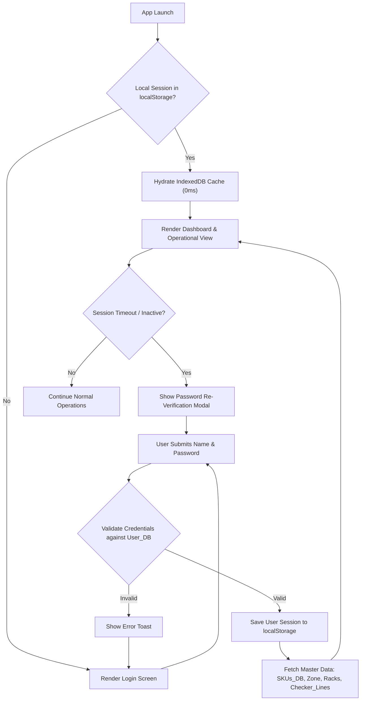
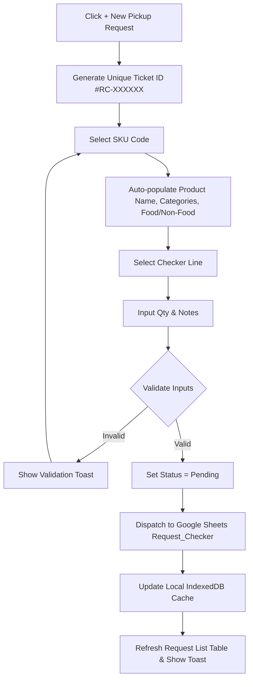
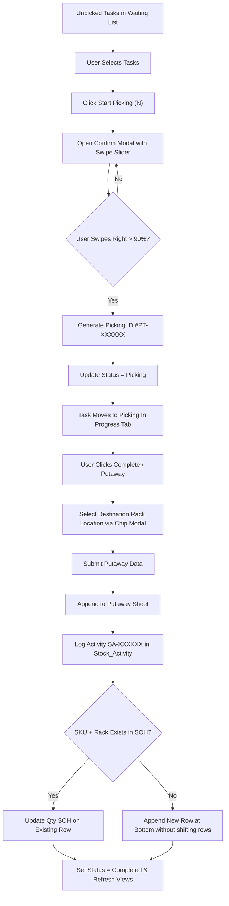
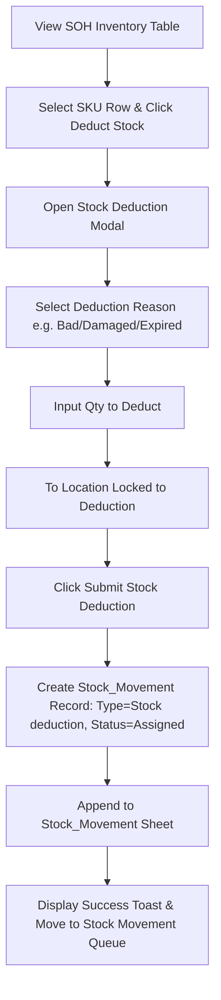
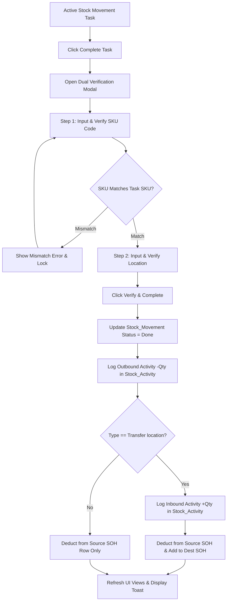
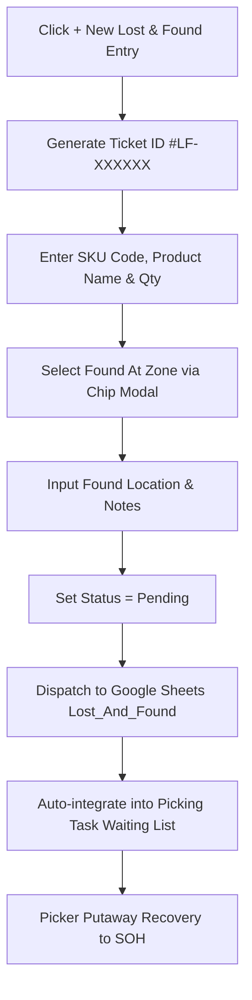
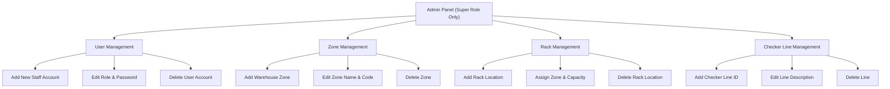
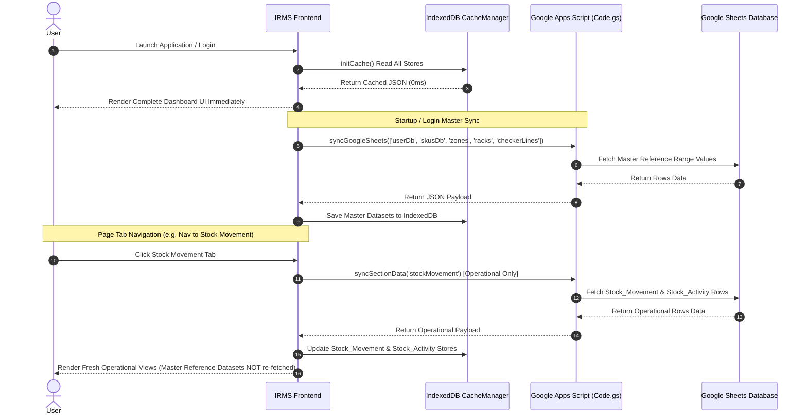

# IRMS (Inventory Recovery Management System) — Comprehensive Workflow Documentation

## Executive Overview

The **Inventory Recovery Management System (IRMS)** is an enterprise-grade, offline-first warehouse inventory recovery and stock management web application. It orchestrates the end-to-end lifecycle of warehouse inventory operations, including pickup requests, task picking, putaway execution, stock-on-hand tracking, location transfers, stock deductions, lost and found item recovery, and administrative configuration.

This document presents the complete, step-by-step operational workflows, business rules, decision logic, and process flowcharts for every feature and module within the system.

---

## 1. User Authentication & Role-Based Access Control Workflow

### 1.1 Overview
The authentication system secures access using role-based permissions (`Super` vs `Staff`/`Checker`/`Picker`), supports 0ms offline startup via IndexedDB cache hydration, and maintains reactive session freshness with automatic inactivity locks.

### 1.2 Step-by-Step Workflow

1. **Application Launch & Local Session Check**:
   - Upon page load, `main.js` checks `localStorage` for `irms_logged_in_user`.
   - If a valid session object exists:
     - The app immediately hydrates local state from IndexedDB (`IRMS_IndexedDB_Cache`).
     - Navigates directly to the main dashboard interface without waiting for remote server response (0ms instant startup).
   - If no session exists:
     - The user is redirected to the `login.js` screen.

2. **Login Credentials Submission**:
   - User inputs **Staff Name** (or Staff ID) and **Password**.
   - Upon clicking **Login**, the system queries `db.getUsers()` (cached locally or fetched from Google Sheets `User_DB`).
   - Credentials match check:
     - Normalizes input string (`trim()`, `toLowerCase()`).
     - Verifies password match.
   - **On Success**:
     - User session stored in `localStorage` under `irms_logged_in_user`.
     - Master Reference Datasets (`SKUs_DB`, `Zone`, `Checker_Lines`, `Racks`) are fetched from Google Sheets.
     - Navigates to default operational dashboard tab.
   - **On Failure**:
     - Displays error toast notification ("Invalid Staff Name or Password").

3. **Session Auto-Lock & Expiry Check**:
   - `checkAndRefreshIfExpired()` continuously evaluates token freshness.
   - If session expires or user is inactive beyond timeout threshold:
     - Modal blocker prompt appears requiring password re-verification to resume session.

4. **Data Sync & Cache Refresh Options Modal**:
   - User clicks top sync badge (`.headerSyncBtn`) or floating refresh button.
   - Opens `openRefreshOptionsModal()` presenting two options:
     - **Regular Refresh (Fetch Updates)**: Synchronizes current active operational section data (`db.syncGoogleSheets(activeTab)`).
     - **Flush Cache & Full Resync**: Purges IndexedDB (`cacheManager.clearAll()`), re-fetches all sheets from Google Sheets source-of-truth, and re-hydrates local cache.

### 1.3 Authentication & Session Flowchart

---

## 2. Pickup Request Workflow (`Request_Checker`)

### 2.1 Overview
The **Pickup Request** module enables checkers and warehouse staff to create requests for item retrieval from checker lines. Each request generates a unique ticket ID (`#RC-XXXXXX`), auto-populates product metadata from the master SKU database, and logs the request into Google Sheets.

### 2.2 Step-by-Step Workflow

1. **Initiate Request**:
   - User clicks **+ New Pickup Request** button in `requestPickup.js`.
   - Opens `openNewRequestModal()` containing the request form.

2. **Form Entry & Auto-population**:
   - System generates a pre-formatted ticket ID (`#RC-XXXXXX`) using `db.getNextRequestTicketId()`.
   - **SKU Code Selection**:
     - User types or selects SKU Code from searchable chip menu.
     - Selecting a SKU automatically queries `db.getSkus()` and populates Product Name, Categories, and Food/Non-Food classification.
   - **Checker Line Selection**:
     - User selects Checker Line using `openCheckerLineChipModal()` (chip picker populated from `Checker_Lines` sheet).
   - **Quantity Input**:
     - User enters `Qty` (must be integer > 0).
   - **Reason / Notes**:
     - Optional notes describing reason for pickup.

3. **Form Validation & Submission**:
   - System checks `skuCode`, `checkerLine`, and `qty > 0`.
   - Upon clicking **Submit Request**:
     - Status is set to `Pending`.
     - Payload dispatched via `db.createRequestPickup()` to Google Apps Script `handleCreateRequest`.
     - Entry appended to `Request_Checker` sheet with timestamp (`yyyy-MM-dd HH:mm:ss`).
     - Local IndexedDB store updated immediately for instant UI feedback.
     - Success toast displayed; modal closes; request list table refreshes.

### 2.3 Pickup Request Process Flowchart

---

## 3. Picking Task & Putaway Execution Workflow (`Picking_Task`)

### 3.1 Overview
The **Picking Task** module aggregates all unpicked waiting requests (from `Request_Checker` and `Lost_And_Found`), manages bulk picking task assignments, provides an interactive **Swipe-to-Confirm** mobile slider, and oversees putaway completion into warehouse racks.

### 3.2 Detailed Step-by-Step Workflow

#### Phase A: Waiting List Aggregation & Task Selection
1. **View Waiting List**:
   - `pickingTask.js` queries `db.getPendingRequests()` and `db.getPendingLostAndFound()`.
   - Calculates waiting count data badge on **Waiting List** tab icon.
2. **Select Unpicked Tasks**:
   - **Desktop**: User selects individual checkboxes or clicks **Select All**.
   - **Mobile**: User taps mobile task cards to select (`selectedWaitingTicketIds.add(id)`).
   - Floating Action Bar (`mobileStartPickBtn`) displays total selected items count: **"Start Picking (N)"**.

#### Phase B: Bulk Start Picking & Swipe Confirmation
1. **Click Start Picking**:
   - Clicking **Start Picking (N)** opens `openMobileConfirmModal()`.
2. **Review Task List**:
   - Displays list of selected Ticket IDs (`#RC-XXXXXX`, `#LF-XXXXXX`), product names, and quantities.
3. **Swipe-to-Confirm Slider**:
   - User drags the swipe thumb (`#mobileSwipeThumb`) rightward across `#mobileSwipeSliderContainer`.
   - Upon reaching >= 90% drag threshold:
     - Triggers `startPickingTasks()`.
     - Generates picking ID (`#PT-XXXXXX`).
     - Assigns `Picked By` = Current User Staff Name.
     - Updates status from `Pending` -> `Picking` in Google Sheets (`Picking_Task`, `Request_Checker`, `Lost_And_Found`).
     - Selected tasks transition to the **Picking (In Progress)** sub-tab.

#### Phase C: Putaway Execution & Inventory Integration
1. **Initiate Putaway**:
   - User navigates to **Picking (In Progress)** sub-tab.
   - Clicks **Complete / Putaway** button on task card.
   - Opens `openPutawayModal()`.
2. **Select Destination Rack Location**:
   - User clicks **Select Location** chip picker (`openRackLocationChipModal()`).
   - Modal filters `Racks` sheet list by selected **Zone**.
   - User selects destination Rack Location (e.g. `A-01-02`).
3. **Submit Putaway**:
   - User inputs `Qty Put` (defaulting to task Qty).
   - System submits via `db.createPutaway()` -> Google Apps Script `handleCreatePutaway`:
     - Append row to `Putaway` sheet in Google Sheets.
     - Append row to `Stock_Activity` sheet (`Activity ID`: `SA-XXXXXX`, `Operator`: `[+]`, `From Location`: Checker Line / Found At, `To Location`: Destination Rack).
     - **SOH Update**: Checks `SOH` sheet for existing row matching `SKU Code` + `Rack Location`.
       - If matching row exists: Updates `Qty SOH` and `Updated At` on that row.
       - If no matching row exists: Appends new row at `lastDataRow + 1` without calling `insertRowAfter()` (preserving row 2 `ARRAYFORMULA` calculations for `Qty On SO`, `Count SO`, `Qty On LDP`, `Stock Age`, `Action Suggestion`).
     - Task status updated to `Completed`.

### 3.3 Picking Task Lifecycle Flowchart

---

## 4. Stock On Hand (SOH) & Stock Deduction Workflow (`SOH`)

### 4.1 Overview
The **Stock On Hand (SOH)** module provides real-time visibility into current warehouse inventory levels across all rack locations. It includes multi-criteria search filters, KPI summary metrics, and a controlled **Stock Deduction** assignment process for bad, damaged, expired, or missing inventory.

### 4.2 Step-by-Step Workflow

1. **Dashboard & Metric Inspection**:
   - `soh.js` displays KPI cards: Total SOH SKUs, Total Qty SOH, High Age Stock, and Deduction Required.
   - User filters inventory by SKU Code, Product Name, Category, Rack Location, or Stock Age.

2. **Initiate Stock Deduction**:
   - User selects an inventory row and clicks **Deduct Stock**.
   - Opens `openStockDeductionModal()`.

3. **Deduction Entry & Lock Controls**:
   - System populates SOH row details: SKU Code, Product Name, Current Rack Location, Current Qty SOH.
   - **Reason Selection**: User selects reason (`Bad/Damaged/Expired`, `Lost/Missing`, `Discrepancy Correction`, `Sample/Testing`).
   - **Qty to Deduct**: User enters deduction quantity (`1 <= Qty <= Current Qty SOH`).
   - **Destination Location**: `To Location` input is automatically **disabled** and locked to `"Deduction"`.

4. **Submission & Stock Movement Creation**:
   - Clicks **Submit Stock Deduction**:
     - Calls `db.createStockMovement()` with `Type = "Stock deduction"`, `From Location = Current Rack`, `To Location = "Deduction"`, `Status = "Assigned"`.
     - Appends movement task to Google Sheets `Stock_Movement` sheet.
     - Task enters **Stock Movement & Deduction** queue for verification and execution.

### 4.3 Stock Deduction Flowchart

---

## 5. Stock Movement & Dual Verification Workflow (`Stock_Movement`)

### 5.1 Overview
The **Stock Movement** module executes location transfers between racks and handles final authorization for stock deductions. To prevent warehouse errors, completing a movement requires a **Dual Verification** step confirming SKU Code and Location.

### 5.2 Step-by-Step Workflow

1. **View Active Movements**:
   - User navigates to **Stock Movement & Deduction** module (`stockMovement.js`).
   - Views tasks filtered into `Transfer location` or `Stock deduction`.

2. **Initiate Completion & Verification**:
   - User clicks **Complete Task** on an active movement card.
   - Opens `openCompleteMovementModal()`.

3. **Step 1: SKU Code Verification**:
   - System prompts operator to scan or type the **SKU Code**.
   - Input is validated against expected task SKU (`skuCode`).
   - If mismatch: Displays error notification; prevents completion.

4. **Step 2: Location Verification**:
   - **For Transfer Location**: Operator confirms or enters destination `To Location` (e.g. `B-04-12`).
   - **For Stock Deduction**: Destination location defaults to `Deduction`; free-text location entry is supported without rack master restrictions.

5. **Execution & Inventory Adjustment**:
   - Upon clicking **Verify & Complete**:
     - Status updated to `Done` in `Stock_Movement` sheet.
     - **Dual Stock Activity Logging**:
       - Log 1: Outbound deduction `[-]` from `fromLocation` (Quantity `-Qty`).
       - Log 2 (if transfer): Inbound addition `[+]` to `toLocation` (Quantity `+Qty`).
     - **SOH Live Adjustment**:
       - Deducts Qty from `fromLocation` row in `SOH` sheet.
       - Adds Qty to `toLocation` row if location transfer (updating existing row or appending at bottom without disturbing row 2 `ARRAYFORMULA`).

### 5.3 Stock Movement Verification Flowchart

---

## 6. Lost & Found Management Workflow (`Lost_And_Found`)

### 6.1 Overview
The **Lost & Found** module enables warehouse staff to record uncataloged, misplaced, or found items across warehouse zones (`#LF-XXXXXX`). Found items automatically integrate into the picking waiting list for putaway recovery into active inventory.

### 6.2 Step-by-Step Workflow

1. **Log Found Item**:
   - User clicks **+ New Lost & Found Entry** in `lostAndFound.js`.
   - Opens `openLostAndFoundModal()`.

2. **Form Entry & Zone Picker**:
   - Generates unique ID (`#LF-XXXXXX`).
   - User inputs SKU Code (or enters generic description), Product Name, and Qty.
   - User selects **Found At Zone** using `openZoneChipModal()` (chip picker modal rendered at `z-index: 6000 !important` to float cleanly over form overlay `z-index: 5000`).
   - User selects specific location/bin and reason notes.

3. **Submission & Recovery Queue**:
   - Status set to `Pending`.
   - Saved to Google Sheets `Lost_And_Found` sheet via `handleCreateLostAndFound`.
   - Entry automatically appears in **Picking Task Waiting List** so pickers can retrieve the found item and complete putaway into standard rack SOH.

### 6.3 Lost & Found Recovery Flowchart

---

## 7. Admin & Reference Data Management Workflow (`Admin`)

### 7.1 Overview
The **Admin Panel** (`admin.js`) is restricted exclusively to users with the `Super` role. It manages system master reference datasets: Users, Warehouse Zones, Rack Locations, and Checker Lines.

### 7.2 Step-by-Step Sub-Tab Workflows

---

## 8. Data Synchronization & Cache Lifecycle Workflow (`db.js` & `cacheManager.js`)

### 8.1 Overview
IRMS implements an offline-first **Hybrid Cache & Sync Architecture** combining IndexedDB for 0ms local hydration, section-isolated navigation syncs, and background Google Apps Script (`Code.gs`) sheet updates.

### 8.2 Dataset Synchronization Classifications

| Dataset Name | Classification | Fetch Frequency & Trigger |
| :--- | :--- | :--- |
| `SKUs_DB` | Master Reference | App launch, fresh user login, F5 browser refresh only |
| `Zone` | Master Reference | App launch, fresh user login, F5 browser refresh only |
| `Checker_Lines` | Master Reference | App launch, fresh user login, F5 browser refresh only |
| `Racks` | Master Reference | App launch, fresh user login, F5 browser refresh only |
| `User_DB` | Master Reference | App launch, fresh user login, F5 browser refresh only |
| `Request_Checker` | Operational Section | Navigation to Pickup Request tab / Section sync |
| `Picking_Task` | Operational Section | Navigation to Picking Task tab / Section sync |
| `Putaway` | Operational Section | Navigation to Picking Task tab / Section sync |
| `SOH` | Operational Section | Navigation to SOH tab / Section sync |
| `Stock_Movement` | Operational Section | Navigation to Stock Movement tab / Section sync |
| `Stock_Activity` | Operational Section | Navigation to Stock Movement tab / Section sync |
| `Lost_And_Found` | Operational Section | Navigation to Lost & Found tab / Section sync |

### 8.3 Data Synchronization Sequence Diagram

---

## Summary Matrix of System Feature Workflows

| Feature Module | Primary User Role | Initiating Action | Destination Sheets Updated | Key Output Artifact |
| :--- | :--- | :--- | :--- | :--- |
| **Pickup Request** | Checker / Staff | Create Request Modal | `Request_Checker` | Ticket ID `#RC-XXXXXX` |
| **Picking Task** | Picker / Staff | Swipe-to-Confirm Slider | `Picking_Task`, `Request_Checker`, `Lost_And_Found` | Picking ID `#PT-XXXXXX` |
| **Putaway Completion** | Picker / Staff | Submit Putaway Modal | `Putaway`, `Stock_Activity`, `SOH` | Activity ID `SA-XXXXXX` |
| **Stock Deduction** | Staff / Super | Submit SOH Deduction | `Stock_Movement` | Movement ID (Stock Deduction) |
| **Stock Movement** | Staff / Super | Dual SKU & Location Verify | `Stock_Movement`, `Stock_Activity`, `SOH` | Outbound/Inbound Log `SA-XXXXXX` |
| **Lost & Found** | Staff / Checker | Create L&F Modal | `Lost_And_Found` | Ticket ID `#LF-XXXXXX` |
| **Admin Management** | Super Role Only | Add/Edit Admin Forms | `User_DB`, `Zone`, `Racks`, `Checker_Lines` | Master Record Updates |
