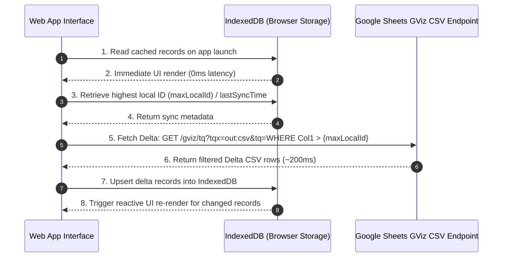

# Backend Sync & Performance Improvement Plan (IRMS)

This document details the strategy and implementation plan for scaling data fetching, caching, and synchronization in the **IRMS (Inventory & Warehouse Management System)** using Google Sheets as the backend data source.

---

## 1. Core Architecture Decisions

1. **100% GViz CSV Endpoint (`/gviz/tq?tqx=out:csv`) for Data Fetching**
   - **Rationale**: Google Apps Script (`doGet`) web apps introduce high execution latency (1–3s+) and cold starts. The GViz CSV endpoint connects directly to Google Visualization services, responding in ~200–500ms.
2. **Client-Side Persistent Caching via IndexedDB**
   - **Rationale**: In-memory Javascript state is lost on page refresh. Using browser IndexedDB allows the application to render **instantly (0ms)** on startup using cached data before fetching updates in the background.
3. **GViz `tq` Incremental Delta Sync**
   - **Rationale**: Downloading full CSV files for 10,000+ row datasets consumes excessive bandwidth and CPU during PapaParse execution. By passing Google Visualization Query Language (`tq`) expressions, Google filters the spreadsheet server-side and returns only new or modified rows.

---

## 2. Technical Data Flow

---

## 3. Data Classification & Sync Matrix

To optimize bandwidth, sheets are categorized based on change frequency and lifecycle:

| Tier | Sheets / Tabs | Update Frequency | GViz `tq` Query Pattern | Local Cache TTL |
| :--- | :--- | :--- | :--- | :--- |
| **Tier 1: Master Data** | `SKUs DB`, `Racks`, `Zones`, `Users DB` | Low (Daily / Manual) | Fetch full CSV only on cache miss or manual sync. | 24 Hours |
| **Tier 2: Append-Only Logs** | `Stock Movement`, `Stock Activity`, `Lost & Found` | High (Continuous) | `SELECT * WHERE Col1 > {maxLocalID}` | Persistent (Append Delta) |
| **Tier 3: Active Tasks & State** | `Picking Task`, `Putaway`, `Request Checker`, `SOH` | High (Continuous) | `SELECT * WHERE ColStatus != 'Completed'` OR `WHERE ColUpdated > datetime '{lastSync}'` | Persistent (Upsert Delta) |

---

## 4. Phased Implementation Roadmap

### Phase 1: Client-Side Storage Layer (`src/data/cacheManager.js`)
- [ ] Create IndexedDB wrapper (`cacheManager.js`) using native IndexedDB or `Dexie.js`.
- [ ] Define stores for each sheet (`soData`, `pickingTask`, `stockMovement`, `skusDb`, etc.).
- [ ] Implement index keys (`id`, `sku`, `so_number`, `task_id`) for fast lookups and upserts.
- [ ] Provide helper methods: `getStore(name)`, `upsertDelta(name, records)`, `getMaxId(name)`.

### Phase 2: GViz Delta Query Integration (`src/data/db.js`)
- [ ] Upgrade fetch helper in `src/data/db.js` to build dynamic GViz `tq` queries.
- [ ] **Delta Fetch logic**:
  - Check `maxLocalId` or `lastSyncTime` from `cacheManager`.
  - Construct query string: `tq=${encodeURIComponent("SELECT * WHERE Col1 > " + maxLocalId)}`.
- [ ] Parse incoming delta CSV snippets via PapaParse and bulk-write to `cacheManager`.

### Phase 3: Cache-First UI Hydration
- [ ] Update `main.js` and component entry points to load initial data synchronously from IndexedDB.
- [ ] Render tables immediately from local cache.
- [ ] Trigger background fetch and update UI reactively when new delta rows arrive.

### Phase 4: Sheet Row Archiving Policy
- [ ] Implement an archiving routine for `Picking Task` and `Putaway` sheets.
- [ ] Periodically move completed tasks (>30 days old) to an archive sheet (e.g. `Picking_Task_Archive`).
- [ ] Ensures active sheet remains lightweight (<1,000 rows) for maximum Google Sheets server-side evaluation speed.

---

## 5. Verification & Testing Criteria

1. **Payload Reduction Test**: Measure total network transfer during a sync operation. Benchmark target: **>80% reduction** compared to full CSV fetch.
2. **Startup Speed Benchmark**: Measure initial UI render time on page load. Benchmark target: **<50ms** (hydrated from IndexedDB).
3. **Data Integrity Test**: Test edge cases including browser cache clear, offline operation, and concurrent record updates across multiple tabs.
